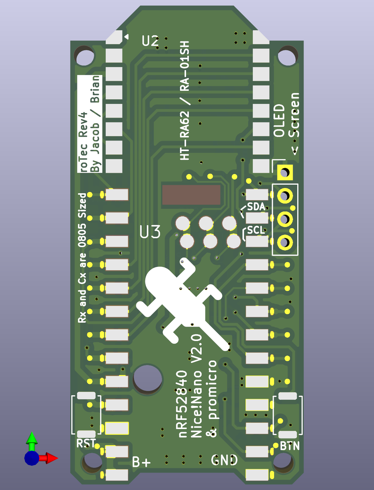
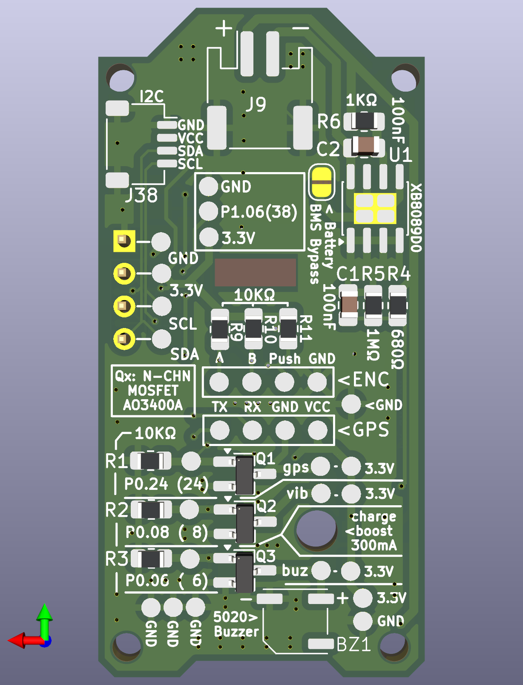

# fakeTec_pcb
My personal modification of the fakeTec, a low-cost nRF52 device with the form-factor of the Heltec v2, v3, & v4 devices 
compatible with [Meshtastic](https://meshtastic.org/)®.

This design is specifically based off of [Šimon Hořánek's](https://github.com/ShimonHoranek) 
[fakeTec V5 Rev. B](https://github.com/gargomoma/fakeTec_pcb/issues/24), licensed under 
[CERN-OHL-P-2.0](https://choosealicense.com/licenses/cern-ohl-p-2.0/).

# Pictures

Click to open

| Front                               | Back                              |
|:------------------------------------|:----------------------------------|
|  |  |

## Features
- Small size based on Heltec v3: You can use the same cases!
- Lora with Heltec's HT-RA62
- Uses a [n!cenano](https://nicekeyboards.com/nice-nano/) or 
  [NRF52840 ProMicro](https://github.com/joric/nrfmicro/wiki/Alternatives#supermini-nrf52840l)
- BMS For low voltage cutout to prevent LiPo Overdraining
- Battery level sensing
- JST PH2.0mm connector for batteries
- I2C side ports ready to connect an OLED SSD1306 screen.
- Pads for connecting an encoder for canned messages
- Pads for connecting a serial GPS module
- MOSFETs for switching high current components
  - Using a solder pad jumper, MOSFET 1 can chose between the GPS module ground to enable power saving the GPS module, 
    or a regular pad like MOSFETs 2 & 3.
- 2mm mounting holes

## Modifications from fakeTec V5 Rev. B
- Cleaned up schematic
  - Changed Pins representing sides of MCUs to symbols fully representing said MCU
  - Changed labels to my preferred naming scheme
- Setup netclasses
- Shifted pads `P1.01`, `P1.02`, and `P1.07` to where I'm pretty sure they're supposed to be
- Removed jumper for BMS
  - I will always install a BMS
- Removed jumper for GPS/FET1 Drain to FET1
  - Only one will be connected at a time, probably no difference if this is permanently connected to both
- Switched mosfets to AO3400A
  - I already have these and they're a drop in replacement
- Changed all resistors and Capacitors to 805 sized
  - I already have all the resistors in this size
- Added pullup resistors to rotary encoder pads
  - These probably support internal pullups, but just to be safe
- Added ground pad to rotary encoder pads
- Changed battery connector to a JST PH-2.0mm
  - Struggled to find JST 1.25 connectors
  - PH-2.0mm are also apparently more reliable
- Removed lots of silkscreen text
  - Don't need values or component names, just component references
  - Most of it was overlapping
- Moved BMS to side
  - Keeps it out the way of the battery connector
- Added a lot more stitching between front and back ground planes
- Removed vias from on top of silkscreen and off of pads
- Attempted to reduce layer crossings

# Variants

(aka firmware files)

| Version      | Lora Modules                     | Official Repo link                                                                                                                                          | Unofficial Repo link                                                                                                                                                                |
|:-------------|:---------------------------------|:------------------------------------------------------------------------------------------------------------------------------------------------------------|:------------------------------------------------------------------------------------------------------------------------------------------------------------------------------------|
| With TCXO    | EByte E22/E220-xxxM-22S/HT-RA62  | <a href="https://github.com/meshtastic/firmware/tree/master/variants/nrf52840/diy/nrf52_promicro_diy_tcxo" target="_blank">Official repo - With TCXO</a>    | <a href="https://github.com/mrekin/MeshtasticCustomBoards/tree/main/firmware/variants/nrf52840/diy/promicro_diy_m" target="_blank">With TCXO</a> @mrekin/MeshtasticCustomBoards     |
| Without TCXO | EByte E22/E220-xxxMM-22S/RA-01SH | <a href="https://github.com/meshtastic/firmware/tree/master/variants/nrf52840/diy/nrf52_promicro_diy_xtal" target="_blank">Official repo - Without TCXO</a> | <a href="https://github.com/mrekin/MeshtasticCustomBoards/tree/main/firmware/variants/nrf52840/diy/promicro_diy_mm" target="_blank">Without TCXO</a> @mrekin/MeshtasticCustomBoards |

ℹ️If you don't want to build your own image use <a href="https://flasher.meshtastic.org/" target="_blank">the official web flasher</a>

# Bill of materials

| Part                           | Source                                                                                                                                      | Note                                                                                                      |
|:-------------------------------|:--------------------------------------------------------------------------------------------------------------------------------------------|:----------------------------------------------------------------------------------------------------------|
| NRF52840 ProMicro or n!icenano | [AliExpress](https://www.aliexpress.com/item/1005006446457448.html)  [niceKeyboards](https://nicekeyboards.com/nice-nano/#find-a-store) |[Please read it before buying red ProMicros](https://github.com/gargomoma/fakeTec_pcb/issues/30)           |
| HT-RA62                        | [Heltec](https://heltec.org/project/ht-ra62/)  [AliExpress](https://www.aliexpress.com/item/1005005543917617.html)                      | I'd get it directly from heltec                                                                           |
| XB8089D0 BMS                   | [LCSC](https://www.lcsc.com/product-detail/C2760005.html)                                                                                   |                                                                                                           |
| 3x AO3400A MOSFETs             | [LCSC](https://www.lcsc.com/product-detail/C347475.html)  [AliExpress](https://www.aliexpress.com/item/1005007115799728)                | Quite frankly, any logic level N-Channel MOSFET with a `SOT-23` footprint that takes at least 5v will do. |
| SMD JST PH2.0mm Socket         | [LCSC](https://www.lcsc.com/product-detail/C295747.html)  [LCSC](https://www.lcsc.com/product-detail/C7429689.html)                     |                                                                                                           |
| SMD 805 Resistors              |                                                                                                                                             | You'll need 1x 1k, 8x 10K, 1x 680K, 1x 1M                                                                 |
| SMD 805 Ceramic Capacitors     |                                                                                                                                             | You'll need 4 x 100nF                                                                                     |
| 2x smd Button                  | [LCSC](https://www.lcsc.com/product-detail/C41427500.html)                                                                                  | You want something around 4 x 3 x 2                                                                       |
| OLED SSD1306 i2c (optional)    | [AliExpress](https://www.aliexpress.com/item/1005005970901119.html)                                                                         |                                                                                                           |
| Battery connection (optional)  | [AliExpress](https://www.aliexpress.com/item/1005002564191148.html)                                                                         | This is an example.                                                                                       |
| Glue Stick Sprint Antenna      | [AliExpress](https://www.aliexpress.com/item/1005008671071222.html)                                                                         |                                                                                                           |
| Antenna (Recommended           | [AliExpress](https://www.aliexpress.com/item/1005004607615001.html)                                                                         |                                                                                                           |
| Antenna pigtail (recommended)  | [AliExpress](https://www.aliexpress.com/item/4001287491018.html)                                                                            | It may underperformed with a cheap black pigtail.                                                         |
| PCB                            |                                                                                                                                             | Use your favourite company to get the PCB. I use [JLCPCB](https://jlcpcb.com/)                            |

# About Meshtastic
[Meshtastic](https://meshtastic.org/)® is a registered trademark of Meshtastic LLC. Meshtastic software components are released under various licenses, see github for details.

# Disclaimer
No warranty is provided.
You use it at your own risk and take the responsibility upon yourself.
